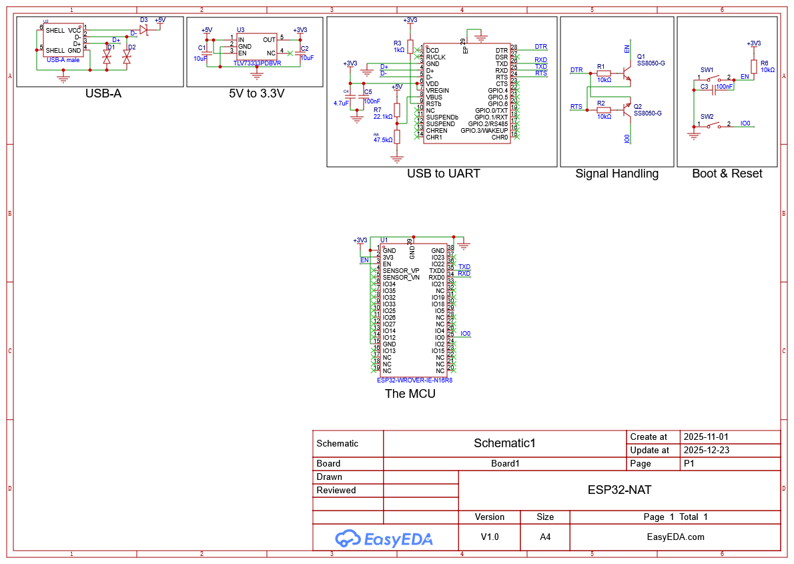
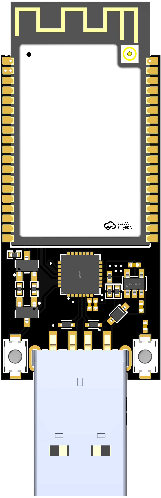
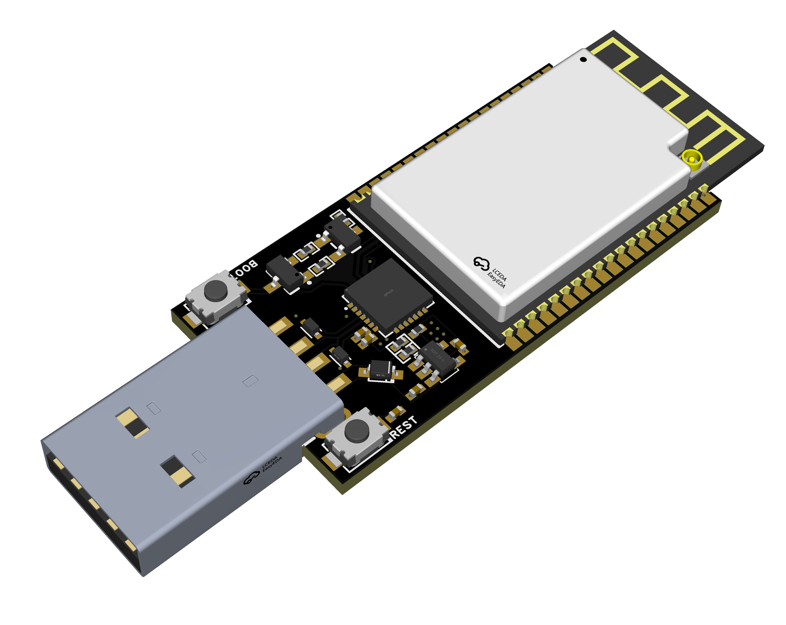
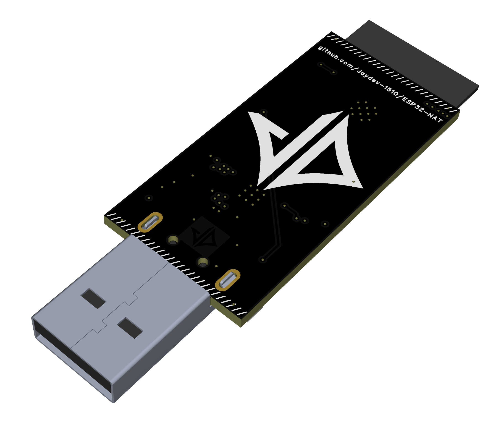

# ESP32-NAT

**ESP32-NAT** is a custom build PCB with ESP32 which is specifically designed for a router use case. It's powered by [@dchristl](https://github.com/dchristl)'s [ESP32 NAT Router Extended](https://github.com/dchristl/esp32_nat_router_extended) firmware based on Martin Ger's [martin-ger's ESP32 NAT Router-project](https://github.com/martin-ger/esp32_nat_router). This takes the project to next level with features like -

- Extend range of WiFi network (Repeater)
- Additional network for guests
- Portable usage with a compact build and built in USB-A
- [Bypass restrictions](https://github.com/dchristl/esp32_nat_router_extended/docs/advanced.md#advanced-configuration) in public WiFis, like device and rate limit
- Scanning for APs
- User friendly UI with mobile support
- [Resetting the device](https://github.com/dchristl/esp32_nat_router_extended/docs/advanced.md#resetting-the-device-erasing-the-flash) in UI and with Pin/Button
- [OTA-Updates](https://github.com/dchristl/esp32_nat_router_extended/docs/ota.md)
- Keep connection alive on networks with forced disconnect
- Secure frontend by password or complete disabling
- Show connected state and quality in UI
- **Exclusive** - External wifi antenna support

> ### 🧠 **Powered by ESP32-WROVER-IE-N16R8** — 16MB Flash + 8MB RAM

## 📷 Pictures

## 🚀 Getting Started

1. Flash the firmware from [ESP32 NAT Router Extended](https://github.com/dchristl/esp32_nat_router_extended/releases) to your ESP32 Board
2. Plug it into any USB port — it’ll enumerate as a NAT router device
3. Hack!

> Please check out [ESP32 NAT Router Extended](https://github.com/dchristl/esp32_nat_router_extended)

## 🧩 Hardware

* MCU: **ESP32-WROVER-IE-N16R8**
* Flash: **16MB**
* RAM: **8MB**
* USB: **Built-in USB-A connector**
* Button: **Tact switch for Boot & Reset**

## ❌ Wifi scanning limitation
Due to technical limitations, a client cannot be simultaneously connected to the device and scan for Wi-Fi networks. Before the scan starts, all the clients will be disconnected. After that, the scan will be saved in NVS,and the device will reboot. Upon reconnecting to the device, you will be able to view the scanned networks.

An automatic redirect occurs the first time. Afterward, the scanned networks can be viewed three more times before they are deleted from the NVS to save storage space.

## 📢 Shoutout

I would like to thank [@Martin-ger](https://github.com/martin-ger) and [@dchristl](https://github.com/dchristl) for their outsanding work and contribution. This project would be indispensable without their contribution. Thanks! 

## ⚠️ Disclaimer

This project is for **ethical, educational and personal use only**.
Do **not** use it for unknown, banking, sensitive networks without proper review.

## 💡 Contributing

Feel free to contribute by creating a pull request.
